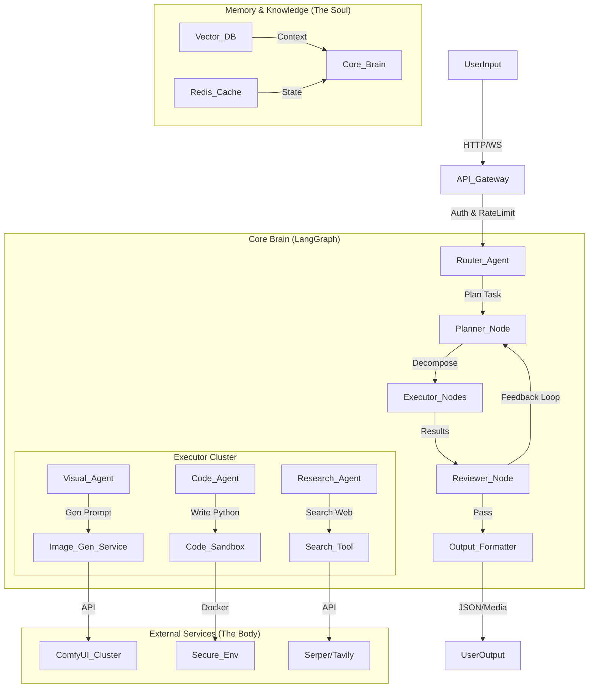

# 02. 炼魄 (The Refining) - 架构映射表
## The Architecture Mapping Table

**目标 (Objective)**: 将探测到的感性黑盒逻辑，映射为理性的开源工程组件。
**原则 (Principle)**: 
1.  **去伪存真**: 识别出哪些是营销话术，哪些是真实技术。
2.  **成本替代**: 寻找开源/低成本方案替代闭源/昂贵方案。
3.  **模块解耦**: 将复杂功能拆解为单一职责的组件。

---

## 🗺️ 核心映射表 (Core Mapping Table)

| 探测到的现象 (Phenomenon) | 对应的开源引擎/组件 (The Engine) | Cursor 实现建议 |
| :--- | :--- | :--- |
| **角色一致性 (Visual Consistency)** | **IP-Adapter / FaceID / Pulid** | `services/consistency_manager.py`: 注入 Reference Tensor |
| **动效节奏感 (Kinetic Timing)** | **Remotion / MoviePy / GSAP** | `services/kinetic_renderer.py`: 生成 XML/JSON 控制时间轴 |
| **人物口型自然 (Lip Sync)** | **LivePortrait / MuseTalk** | `services/avatar_driver.py`: 调用 REST API 处理音频对齐 |
| **任务拆解精准 (Task Decomposition)** | **LangGraph / CrewAI** | `agents/planner.py`: 定义 StateGraph 和 Plan Schema |
| **多角色协同 (Multi-Agent Collab)** | **LangGraph Supervisor** | `agents/router.py`: 实现条件路由 (Conditional Edges) |
| **复杂逻辑推理 (Reasoning)** | **OpenAI o1 / Claude 3.5 Sonnet** | `core/llm.py`: 设置高成本模型仅用于推理节点 |
| **简单文本生成 (Text Gen)** | **Haiku / Flash / Local LLM** | `core/llm.py`: 设置低成本模型用于润色/翻译 |
| **长记忆保持 (Long-term Memory)** | **RAG (Chroma / PgVector)** | `tools/memory.py`: 向量数据库存储与检索 |

---

## 🏗️ 标准架构图 (Standard Architecture Diagram)

---

## 🧩 组件选型建议 (Component Selection)

### 1. 核心框架 (Core Framework)
*   **LangGraph**: 状态机管理，适合复杂业务流。
*   **FastAPI**: 高性能异步 Web 框架。
*   **Pydantic**: 数据验证与 Schema 定义。

### 2. 模型路由 (Model Router)
*   **LiteLLM**: 统一调用不同厂商模型 (OpenAI, Anthropic, Ollama)。
*   **LocalAI**: 本地部署开源模型 (Llama 3, Mistral)。

### 3. 存储 (Storage)
*   **PostgreSQL**: 关系型数据 (用户, 任务)。
*   **Redis**: 缓存, 任务队列 (Celery/Arq)。
*   **ChromaDB**: 向量存储 (RAG)。

### 4. 前端 (Frontend)
*   **Next.js / React**: 现代 Web 应用。
*   **Streamlit / Chainlit**: 快速原型验证。
